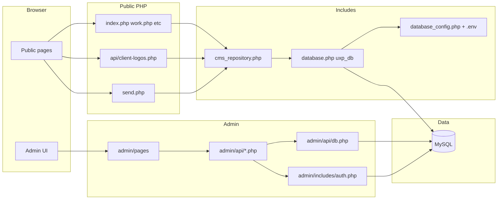

# UX Pacific — Project & Security Audit

This document describes how the UX Pacific codebase is structured, how public and admin flows interact with data, and what security controls exist today. It is **not** a certification that the system is “fully secure”; it includes **known gaps** and **hardening recommendations** for production.

---

## Executive summary

- **Stack:** PHP (server-rendered pages and JSON endpoints), MySQL (via PDO), PHPMailer for outbound email ([send.php](send.php)), optional GD for image handling on uploads.
- **Trust boundaries:** The **marketing site** is mostly read-only PHP plus a public form handler and one small public JSON API. The **admin area** (`/admin`) uses PHP sessions and JSON APIs under `admin/api/` for CRUD against the CMS tables.
- **Single source of truth for DB credentials:** Project root **`.env`** loaded by [includes/database_config.php](includes/database_config.php). [includes/database.php](includes/database.php) (`uxp_db()`, `getDB()`) and [admin/api/db.php](admin/api/db.php) / [admin/includes/auth.php](admin/includes/auth.php) all call `uxp_db_credentials()` — one bootstrap, no duplicate PHP credential files.

---

## Architecture

Visitors use server-rendered pages and static assets. Authenticated admins use the admin UI, which calls same-origin JSON endpoints. The public site can read CMS data through `uxp_db()`; `send.php` sends email and may persist submissions when the DB is configured.

---

## Frontend (public site)

- **Rendering:** PHP templates (e.g. [index.php](index.php), [work.php](work.php), [contact.php](contact.php), [faq.php](faq.php), [service.php](service.php), [ecosystem.php](ecosystem.php)) include shared partials such as [includes/head.php](includes/head.php), [includes/navbar.php](includes/navbar.php), [includes/footer.php](includes/footer.php).
- **CMS-driven content:** [includes/cms_repository.php](includes/cms_repository.php) exposes helpers (projects, ecosystem, FAQs, testimonials, client logos, SEO overlays, etc.) backed by `uxp_db()` when credentials exist; otherwise many helpers degrade gracefully.
- **Global assets:** [main.css](main.css), [main.js](main.js) for layout and interaction across pages.
- **Optional separate frontend:** The [frontend/](frontend) directory contains a build pipeline and artifacts (e.g. `frontend/dist/`); treat as optional unless your deployment actually serves those bundles alongside PHP.

---

## Backend / data layer

| Path | Role |
|------|------|
| [includes/database_config.php](includes/database_config.php) | Loads `.env`, local/live host selection, `uxp_db_credentials(): ?array`. **Only** DB configuration entry point. |
| [includes/database.php](includes/database.php) | `uxp_db(): ?PDO`, `getDB(): PDO` — same static connection; returns `null` if `DB_NAME` missing or connection fails. |
| [admin/includes/auth.php](admin/includes/auth.php) | `adminAuthPdo()` uses `uxp_db_credentials()`. Session helpers, CSRF, `requireAdminAuth`, `requireAdminRole`. |
| [admin/api/db.php](admin/api/db.php) | Sets `$pdo` for admin APIs via `uxp_db_credentials()` (included, not a public HTTP endpoint). |

Schema reference: [database/schema_admin.sql](database/schema_admin.sql).

---

## Admin panel

- **Entry:** [admin/index.php](admin/index.php) — login form with `noindex`, Tailwind CDN, Alpine for password visibility.
- **Session security** ([admin/includes/auth.php](admin/includes/auth.php)): `session_set_cookie_params` with `httponly`, `secure` when HTTPS, `samesite` `Lax`; `password_verify` against `admin_users.password_hash`; `session_regenerate_id(true)` on successful login; generic error on failure (no user enumeration).
- **CSRF:** Login POST uses `adminCsrfToken()` / `adminValidateCsrf()` with `hash_equals`.
- **Authorization:** `requireAdminAuth('api'|'page')` returns 401 JSON or redirects to login. `requireAdminRole('super_admin', ...)` for destructive maintenance endpoints.
- **UI:** [admin/dashboard.php](admin/dashboard.php), [admin/includes/layout.php](admin/includes/layout.php), CRUD pages under [admin/pages/](admin/pages/) (projects, services, FAQs, ecosystem, contacts, reviews, client logos, etc.).

---

## API inventory

Paths are relative to the project root. **Always prefer HTTPS in production.**

### Public endpoints

| Endpoint | Auth | Notes |
|----------|------|--------|
| [api/client-logos.php](api/client-logos.php) | None | Read-only JSON; `Cache-Control: public, max-age=120`; uses `get_visible_client_logos()` from CMS helpers. |
| [send.php](send.php) | None | **POST only**; JSON or form body; validates `form_type`, email, fields; HTML-escapes values used in email bodies; PHPMailer SMTP; optional DB write for contact flow; logs to `storage/logs/form-handler.log` when enabled. |

### Admin JSON / actions (`admin/api/`)

| File | Auth gate | Purpose (summary) |
|------|-------------|-------------------|
| [admin/api/auth.php](admin/api/auth.php) | Session-aware | `action=logout` GET → logout redirect; otherwise JSON auth probe / user payload if logged in. |
| [admin/api/dashboard.php](admin/api/dashboard.php) | `requireAdminAuth('api')` | Dashboard metrics / summaries. |
| [admin/api/projects.php](admin/api/projects.php) | `requireAdminAuth('api')` | Projects CRUD + bundled client logos on GET. |
| [admin/api/client_logos.php](admin/api/client_logos.php) | `requireAdminAuth('api')` | Client logo CRUD. |
| [admin/api/testimonials.php](admin/api/testimonials.php) | `requireAdminAuth('api')` | Testimonials / reviews CRUD. |
| [admin/api/services.php](admin/api/services.php) | `requireAdminAuth('api')` | Services CRUD. |
| [admin/api/faqs.php](admin/api/faqs.php) | `requireAdminAuth('api')` | FAQs CRUD. |
| [admin/api/ecosystem.php](admin/api/ecosystem.php) | `requireAdminAuth('api')` | Ecosystem partners CRUD. |
| [admin/api/contacts.php](admin/api/contacts.php) | `requireAdminAuth('api')` | Contact submissions listing / management. |
| [admin/api/upload.php](admin/api/upload.php) | `requireAdminAuth('api')`, POST | Image upload; type/size checks; GD path outputs WebP when possible. |
| [admin/api/setup_db.php](admin/api/setup_db.php) | `requireAdminRole('super_admin', 'api')` | **Destructive schema / DDL** (e.g. drops/recreates tables). High operational risk if exposed on production. |
| [admin/api/seed_db.php](admin/api/seed_db.php) | `requireAdminRole('super_admin', 'api')` | Inserts seed data. |
| [admin/api/test_crud.php](admin/api/test_crud.php) | `requireAdminAuth('api')` | **Test harness** — remove or block on production. |
| [admin/api/test_upload.php](admin/api/test_upload.php) | `requireAdminAuth('api')` | **Test harness** — remove or block on production. |
| [admin/api/db.php](admin/api/db.php) | Included only | PDO bootstrap via `uxp_db_credentials()` / `.env`; not an HTTP endpoint by itself. |

---

## Security controls (what is implemented today)

- **Admin authentication:** Password hashing via `password_verify`; session fixation mitigation with `session_regenerate_id` on login; HTTP-only cookies; Secure flag when HTTPS; SameSite `Lax`.
- **Admin login CSRF:** Token in session compared with `hash_equals`.
- **Admin API surface:** Mutating CMS routes require an authenticated admin session (`requireAdminAuth('api')`).
- **SQL injection (primary pattern):** PDO prepared statements are used in CMS helpers and in many admin API branches (e.g. projects insert/update paths).
- **Public form handler:** Method restriction to POST, allowlist on `form_type`, email validation, output escaping for HTML email fragments, `APP_DEBUG` off by default in [send.php](send.php).
- **Uploads:** Admin-only upload endpoint; file size cap (5 MB in [admin/api/upload.php](admin/api/upload.php)); allowlisted MIME strings; optional re-encode through GD to WebP.
- **Information hygiene (partial):** Admin login page sets `noindex, nofollow`.
- **Directory listing:** Root [.htaccess](.htaccess) sets `Options -Indexes`; [storage/uploads/.htaccess](storage/uploads/.htaccess) sets `Options -Indexes`.

---

## Gaps and recommendations

These items are **observed risks or improvements**, not an exhaustive penetration test.

1. ~~**Duplicate DB configuration**~~ **Resolved:** [admin/api/db.php](admin/api/db.php) and [includes/database.php](includes/database.php) both use [includes/database_config.php](includes/database_config.php) (`uxp_db_credentials()`).

2. **Error disclosure:** Some admin API `catch` paths echo database exception text into JSON (e.g. project save failures). **Recommendation:** Log server-side; return generic `"Database error"` to clients in production.

3. **Upload MIME trust:** [admin/api/upload.php](admin/api/upload.php) checks `$file['type']`, which can be influenced by the client. **Recommendation:** Validate with `finfo_file()` on the temp path and/or verify image dimensions after GD load.

4. **`uploads/` vs `storage/uploads/`:** Project images are written under `uploads/` (relative from admin API). There is **no** `.htaccess` under `uploads/` in this repo; [storage/uploads/.htaccess](storage/uploads/.htaccess) only covers that subtree. **Recommendation:** For Apache, add `uploads/.htaccess` to disable PHP execution (`php_flag engine off` or equivalent); mirror with nginx `location` rules.

5. **Public `send.php` abuse:** No built-in CSRF token, CAPTCHA, or rate limit for anonymous POSTs. **Recommendation:** Add rate limiting (IP + token bucket), honeypot or CAPTCHA if spam appears; consider same-site CSRF token if forms are same-origin only.

6. **Maintenance and test endpoints:** [admin/api/setup_db.php](admin/api/setup_db.php), [admin/api/seed_db.php](admin/api/seed_db.php), [admin/api/test_crud.php](admin/api/test_crud.php), [admin/api/test_upload.php](admin/api/test_upload.php) should not be reachable on a live host except under strict break-glass controls (or removed from deployment artifacts).

7. **Secrets in repo:** Ensure real values for SMTP ([mailer.php](mailer.php)), database credentials (project root **`.env`**), and any API keys are **gitignored** and never committed.

8. **Dependency and server hardening:** This audit does not run Composer CVE scans or PHP-FPM/Apache hardening reviews; schedule those separately.

---

## Operational checklist (production)

- [ ] Terminate TLS (HTTPS) everywhere; enforce HSTS at the edge.
- [ ] Remove or IP-restrict `admin/api/setup_db.php`, `seed_db.php`, `test_*.php`.
- [ ] Confirm `.env` and `mailer.php` are absent from version control (or contain only non-production placeholders).
- [ ] Use a **least-privilege** MySQL user for the running app; reserve DDL rights for migrations only.
- [ ] Restrict `super_admin` accounts; enforce strong passwords and periodic rotation.
- [ ] Backups: automated MySQL dumps and tested restore procedure.
- [ ] Review file permissions on `uploads/`, `storage/logs/`, and web server user separation.

---

## Document maintenance

- **Owner:** Update this file when major endpoints, auth flows, or deployment assumptions change.
- **Last reviewed:** _(set date when you next edit this file)_
